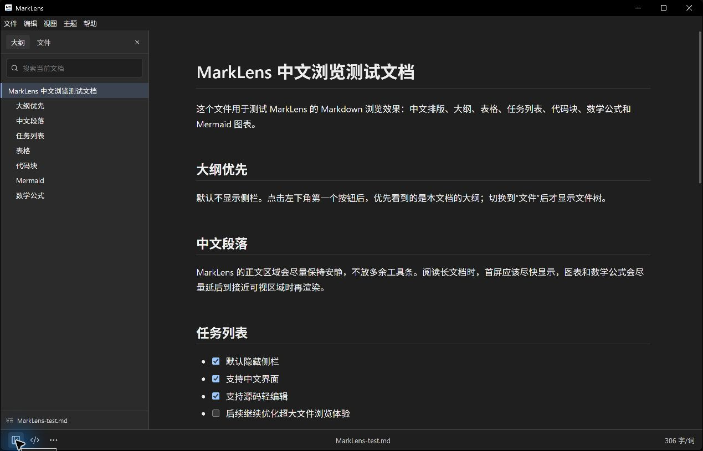

# MarkLens

Language: [简体中文](README.md) | English

MarkLens is a free, open-source WYSIWYG Markdown editor and maintenance tool for Windows. It offers a Typora-inspired editing surface while keeping a source mode for direct Markdown changes.

MarkLens keeps the document first: the sidebar is hidden by default, the outline is the primary navigation surface, and the file tree appears only when it is useful.

## Download

The current project version is **v0.2.2**. Published Windows builds are available from the [Releases page](https://github.com/syd191/marklens/releases); running `npm run dist` produces:

- `MarkLens Setup 0.2.2.exe`: installer.
- `MarkLens-0.2.2-x64-portable.exe`: portable executable.

> Windows builds are currently unsigned, so Microsoft Defender SmartScreen may prompt on first launch.

## Screenshots

MarkLens 0.2.1 document-first WYSIWYG editing view:


MarkLens 0.2.1 outline navigation:



MarkLens 0.2.1 current-folder file browsing:


## What It Does

- Opens `.md`, `.markdown`, and `.txt` files.
- Uses a WYSIWYG editor by default for headings, lists, tables, code blocks, quotes, links, and images.
- Generates a document outline and lets you jump between headings.
- Provides Outline, Files, and Search sidebar views.
- Supports Files context actions: show in File Explorer, create MD file, create folder, rename files and folders.
- Supports round trips between the WYSIWYG editor and Markdown source mode.
- Provides file workflows for recent files, Save As, move, delete, properties, HTML/PDF export, and printing.
- Includes heading, list, table, math, code, quote, link, image, footnote, TOC, and Front Matter commands.
- Supports find/replace, focus and typewriter modes, word count, fullscreen, always-on-top, and zoom.
- Saves pasted or dropped local images beside the document in an `assets` directory.
- Keeps auto save off by default; users must enable it explicitly.
- Supports Github, Newsprint, Night, Pixyll, Whitey, and Follow System themes.
- Follows the system language by default, with Simplified Chinese and English UI.

## Markdown Support

- GFM tables and task lists
- Code highlighting
- Local and remote images
- Links
- KaTeX math
- Mermaid diagrams
- Footnotes
- Document tables of contents (`[TOC]` / `[[toc]]`)
- YAML Front Matter

## Performance Approach

MarkLens is built to make opening and browsing Markdown feel immediate:

- The window waits until the first UI is ready before showing.
- The initial HTML shell applies the saved/system theme before React loads to reduce white flashes.
- The interactive read-only preview splits long Markdown files into chunks.
- The first chunks render first; remaining chunks render during idle time.
- HTML export and copy render the whole document in one pass so TOCs, footnotes, and Front Matter keep document-level semantics.
- Outline generation is deferred by default and runs when needed.
- Mermaid diagrams render near the viewport instead of during the first paint.
- The file tree scans lazily by directory.

## Safety Defaults

- Raw HTML inside Markdown is escaped.
- Electron context isolation and sandbox mode are enabled.
- File access is limited to Markdown-like text files.
- Auto save is opt-in and strictly checks the file modification time before writing.
- Save and automatic refresh revalidate the current document snapshot after asynchronous I/O, preventing late results from overwriting newer edits.

## Development

Requirements:

- Windows
- Node.js 22 or newer

Install dependencies:

```bash
npm install
```

Run locally:

```bash
npm run dev
```

Run checks:

```bash
npm run check
```

Build Windows installer and portable executable:

```bash
npm run dist
```

Build artifacts are written to `../../outputs` from this project folder.

## Project Structure

- `electron/`: Electron main process and preload bridge.
- `src/components/`: React UI components.
- `src/components/RichMarkdownEditor.tsx`: WYSIWYG editor and semantic command bridge.
- `src/components/SourceEditor.tsx`: source editor, history, find, and selection operations.
- `src/lib/editorCommands.ts`: tested Markdown source transformations.
- `src/lib/markdown.ts`: chunking, outline extraction, progressive preview, and whole-document rendering.
- `src/lib/i18n.ts`: Chinese / English UI strings and language resolution.
- `assets/`: App icon source files.
- `docs/`: Architecture and maintenance notes.
- `CHANGELOG.md`: release history.

## License

MIT.
