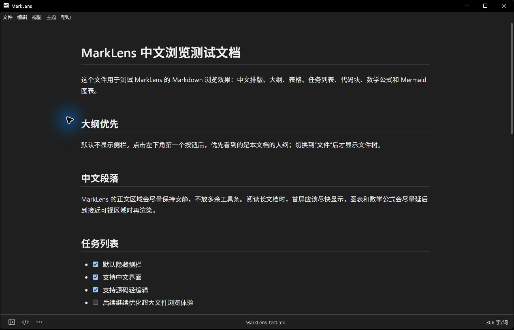
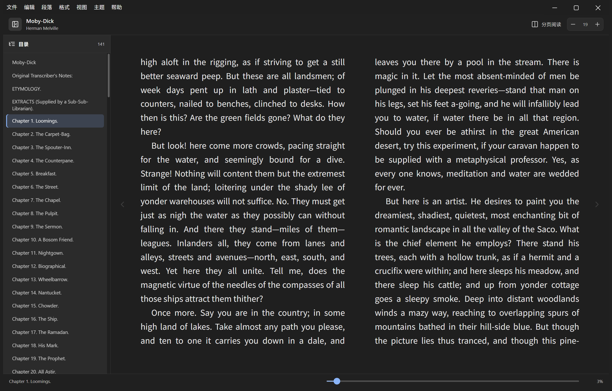

# MarkLens

Language: [简体中文](README.md) | English

MarkLens is a free, open-source Markdown editor, maintenance tool, and EPUB reader for Windows. It offers a Typora-inspired Markdown surface with direct source editing, then switches to a focused reading experience for books.

MarkLens keeps the document first: the sidebar is hidden by default, the outline is the primary navigation surface, and the file tree appears only when it is useful.

## Download

The current project version is **v0.3.0**. Published Windows builds are available from the [Releases page](https://github.com/syd191/marklens/releases); running `npm run dist` produces:

- `MarkLens-Setup-0.3.0-x64.exe`: per-user installer.
- `MarkLens-0.3.0-x64.zip`: regular ZIP distribution recommended for managed intranets.

> Windows builds are currently unsigned, so Microsoft Defender SmartScreen may prompt on first launch.

## Screenshots

Complete Markdown preview:



EPUB reading in the Night theme:



## What It Does

- Opens `.md`, `.markdown`, `.txt`, and `.epub` files; Windows builds can register the EPUB association.
- Reads unencrypted EPUB 2/3 publications, including reflowable, fixed-layout, right-to-left, and vertical-writing books.
- Provides EPUB contents navigation, paginated/scrolling flow, font sizing, chapter and progress navigation, and reading-position persistence.
- Starts in source mode; regular CommonMark/GFM documents can use WYSIWYG editing, while advanced syntax uses the complete document preview.
- Generates a document outline and lets you jump between headings.
- Provides Outline, Files, and Search sidebar views.
- Supports Files context actions: show in File Explorer, create MD file, create folder, rename files and folders.
- Supports round trips between the WYSIWYG editor and Markdown source mode.
- Provides file workflows for recent files, Save As, move, delete, properties, HTML/PDF export, and printing.
- Includes heading, list, table, math, code, quote, link, image, footnote, TOC, and Front Matter commands.
- Supports find/replace, focus and typewriter modes, word count, fullscreen, always-on-top, and zoom.
- Saves pasted or dropped local images beside the document in an `assets` directory.
- Keeps auto save off by default; users must enable it explicitly.
- Supports Github, Newsprint, Night, Pixyll, Whitey, and Follow System themes.
- A custom HTML menu bar re-colors with the active theme while preserving all shortcuts.
- Follows the system language by default, with Simplified Chinese, Traditional Chinese, and English UI.
- Provides per-user NSIS, regular ZIP, portable, and per-machine MSI distributions for IT deployment.

## Markdown Support

- GFM tables and task lists
- Code highlighting
- Local and remote images
- Links
- KaTeX math
- Mermaid diagrams
- Footnotes
- Document tables of contents (`[TOC]` / `[[toc]]`)
- YAML Front Matter

## EPUB Support and Boundaries

- Parsing is provided by a pinned [foliate-js](https://github.com/johnfactotum/foliate-js) commit behind a MarkLens adapter, containing the impact of upstream API changes.
- Publication reading order, language direction, vertical writing, and fixed layout are preserved; themes and font size are applied only to reflowable content.
- Publication scripts are disabled by the content security policy, and external links can only be opened through the system browser.
- DRM, encrypted resources, and script-dependent interactive books are not supported. A single EPUB is limited to 512 MB for safe in-memory loading.
- Corrupt containers, invalid `container.xml` / OPF metadata, and renamed non-EPUB files produce an actionable error instead of a blank reader.

## Performance Approach

MarkLens is built to make opening and browsing Markdown feel immediate:

- The window immediately shows its themed background so renderer failures cannot leave it hidden; startup failures are logged locally.
- The initial HTML shell applies the saved/system theme before React loads to reduce white flashes.
- The rich editor is lazy-loaded, so source-mode startup does not load the Lexical/MDXEditor bundle.
- The EPUB reader and foliate-js are separate lazy chunks, so Markdown startup does not load the book engine.
- Math, Mermaid, footnotes, TOCs, Front Matter, and HTML render as one document to preserve document-level semantics.
- Outline generation is deferred by default and runs when needed.
- Mermaid is loaded on demand and renders each diagram into an isolated SVG.
- The file tree scans lazily by directory.

## Safety Defaults

- Raw HTML is sanitized with DOMPurify: safe formatting remains, while scripts and event handlers are removed.
- Electron context isolation and sandbox mode are enabled.
- File access is limited to Markdown-like text files and read-only EPUB publications.
- EPUB content renders in isolated frames under a strict CSP that blocks publication scripts and limits object, form, and network capabilities.
- Auto save is opt-in and strictly checks the file modification time before writing.
- Save and automatic refresh revalidate the current document snapshot after asynchronous I/O, preventing late results from overwriting newer edits.

## Development

Requirements:

- Windows
- Node.js 22 or newer

Install dependencies:

```bash
npm install
```

Run locally:

```bash
npm run dev
```

Run checks:

```bash
npm run check
```

Build the Windows installer and regular ZIP distribution:

```bash
npm run dist
```

Use `npm run pack` for the portable executable, or `npm run dist:enterprise` for a per-machine MSI intended for IT deployment.

Production enterprise releases should configure code signing through electron-builder's `CSC_LINK` / `CSC_KEY_PASSWORD` variables and set `$env:MARKLENS_REQUIRE_SIGNING="1"` so an unsigned build fails validation.

Build artifacts are written to `dist-build/` together with `build-manifest.json`, which records hashes, signature status, and required runtime-file checks.

## Project Structure

- `electron/`: Electron main process and preload bridge.
- `src/components/`: React UI components.
- `src/components/RichMarkdownEditor.tsx`: WYSIWYG editor and semantic command bridge.
- `src/components/SourceEditor.tsx`: source editor, history, find, and selection operations.
- `src/components/EpubReader.tsx`: EPUB contents, layout, navigation, theming, and reading progress.
- `src/lib/editorCommands.ts`: tested Markdown source transformations.
- `src/lib/markdown.ts`: strict Front Matter recognition, outline extraction, compatibility analysis, safe HTML, and whole-document rendering.
- `src/lib/i18n.ts`: Simplified Chinese / Traditional Chinese / English UI strings and language resolution.
- `assets/`: App icon source files.
- `docs/`: Architecture and maintenance notes.
- `CHANGELOG.md`: release history.

## License

MIT.
